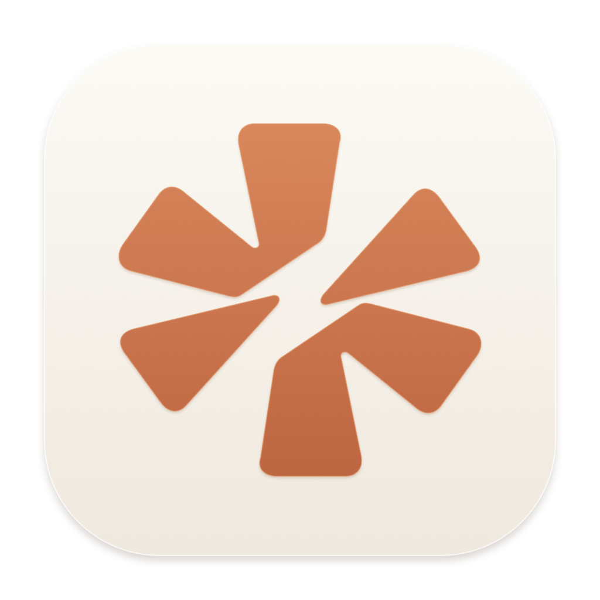

<p align="center"></p>
<h1 align="center">Claudeway</h1>
<p align="center">Claude Desktop accounts and usage limits, one menu-bar app.</p>
<p align="center"><a href="README.ru.md">Русский</a> · <a href="LICENSE">MIT</a> · <a href="CHANGELOG.md">Changelog</a></p>

A small native macOS utility for switching Claude Desktop accounts while keeping
shared local settings and supported Code conversations. Built with Swift and
AppKit, with no third-party Swift dependencies. The current UI is in Russian.

**Independent community software, not affiliated with Anthropic.** It uses
undocumented Desktop storage and usage endpoints. Compatibility may change when
Claude updates. Keep backups of important work.

## Features

- A compact menu-bar account picker; no Dock icon.
- Graceful Desktop restart when switching, with a 30-second timeout and recovery journal.
- One shared local workspace; account-specific encrypted authentication snapshots.
- Local Code history reconciliation, including unfinished chats with real saved messages.
- Five-hour and weekly utilization, server reset times and automatic usage refresh.
- Optional automatic usage-window starts after fresh usage checks, without a schedule.
- Transfer notifications that show only added/updated conversations.
- Optional launch at login; off by default.

## Requirements

| | Requirement |
|---|---|
| System | macOS 13 or newer |
| Claude | Claude Desktop installed and signed in |
| Manual/automatic window start | Official native Claude Code CLI, with the required flags |
| Build | Xcode Command Line Tools with Swift 5.9 or newer |
| Release/audit scripts | Git, Python 3 and standard macOS developer tools |

Account switching concerns **Claude Desktop**. The app does not change your normal
terminal Claude Code login. Optional window starts use a separate disposable CLI
process with the chosen Desktop credential.

## Install

Download the universal macOS ZIP from this repository's **Releases** tab, unpack
it and move **Claudeway.app** to Applications. Open Claude Desktop and sign
in before starting the switcher.

Current community builds are **ad-hoc signed, not notarized**. Downloaded builds
may be blocked by macOS Gatekeeper; building from reviewed source is an alternative.
No Apple Developer signing identity or notarization credentials are bundled.

1. Your current Desktop login is saved as the first local profile.
2. Use **Добавить аккаунт…** to add another account through Claude's normal sign-in UI.
3. Select a profile to restart Desktop with that account.
4. Allow Keychain access when explicitly requested for usage information.
5. Enable **Автозапуск окон** only if you want automatic small requests that consume usage.

See [architecture and data boundaries](docs/architecture.md) before relying on
shared history. Existing installations keep their profiles and settings: the
legacy data directory and bundle identifier are intentionally preserved.

## Build and test

```sh
./test.sh
./build.sh
open "dist/Claudeway.app"
```

Universal app (Apple Silicon + Intel):

```sh
ARCHS="arm64 x86_64" ./build.sh
```

`BUILD_DIR` can select a scratch directory. Build output stays in ignored directories.
The test suite uses synthetic fixtures and temporary directories; it does not
need live Claude credentials, an account, network access or XCTest.

For a disposable UI demo:

```sh
open -n "dist/Claudeway.app" --args --demo
```

## Limits and automatic window starts

Usage refreshes about every five minutes. Manual refresh has a one-minute minimum;
server backoff is respected. Missing or stale information is not treated as zero.

**Запустить окно лимитов** sends one small Sonnet request only when a fresh server
response confirms an idle five-hour window. **Автозапуск окон** does this for selected
accounts after successful usage refreshes. There is no time-of-day schedule or
daily cap. Both automation and launch at login are off on a fresh installation.

It consumes a small amount of usage; it does **not** increase quotas or reset an
active window. Uncertain requests are reconciled before another can be sent, with
a five-hour hold. Expired credentials must be renewed by opening the account in
Claude. The app does not rotate refresh tokens or create a second login.

## Privacy and limitations

- No utility-owned backend, analytics or telemetry. Usage requests go to Anthropic;
  optional inference goes through the official Claude Code CLI.
- Auth decryption is in memory. Tokens are not put in command arguments or app logs.
- Runtime data belongs under Application Support, never in the repository.
- Shared local files are **not an account security boundary**. Cloud Chat, Cowork
  ownership, organization policies and connectors are not shared by this utility.
- New imported Code entries use manual permissions; target-specific grants are preserved.
- Signed official CLI detection is conservative; managed CLI settings disable triggering.
- Permission prompts, notifications and sleep/wake behavior still need manual checks on
  supported Macs. A successful build is not a guarantee of Desktop-version compatibility.

See [SECURITY.md](SECURITY.md) and the [publication privacy audit](docs/privacy-audit.md).

## Contribute and release

Read [CONTRIBUTING.md](CONTRIBUTING.md) and [AGENTS.md](AGENTS.md). CI tests both macOS
architectures. A version tag builds and audits universal artifacts, then creates a
**draft** GitHub Release for review. Publishing instructions are in
[docs/releasing.md](docs/releasing.md).

## License

[MIT](LICENSE), including the original icon artwork. Claude and Claude Code are
trademarks of Anthropic; no Anthropic application binaries are distributed here.
